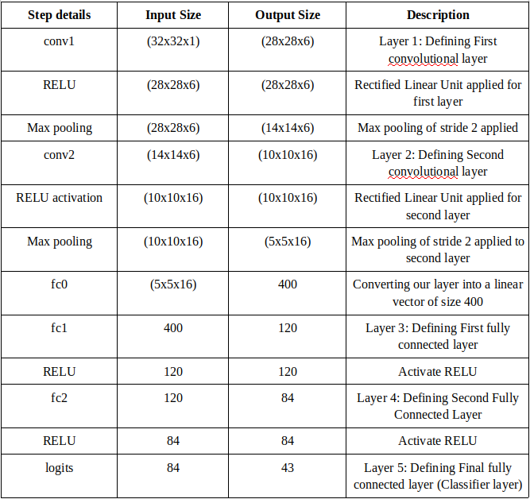

# Traffic Sign Recognition Program
[](http://www.udacity.com/drive)

Overview
---
In this project, you will use what you've learned about deep neural networks and convolutional neural networks to classify traffic signs. You will train and validate a model so it can classify traffic sign images using the [German Traffic Sign Dataset](http://benchmark.ini.rub.de/?section=gtsrb&subsection=dataset). After the model is trained, you will then try out your model on images of German traffic signs that you find on the web.

We have included an Ipython notebook that contains further instructions 
and starter code. Be sure to download the [Ipython notebook](https://github.com/udacity/CarND-Traffic-Sign-Classifier-Project/blob/master/Traffic_Sign_Classifier.ipynb).

This is the writeup for the project in which I have listed the solution approach along with some observations.

To meet specifications, the project will require submitting three files: 
* the Ipython notebook with the code
* the code exported as an html file
* a writeup report either as a markdown or pdf file 
---

The Project
---
The goals / steps of this project are the following:
* Load the data set
* Explore, summarize and visualize the data set
* Design, train and test a model architecture
* Use the model to make predictions on new images
* Analyze the softmax probabilities of the new images
* Summarize the results with a written report

### Dependencies
This lab requires the following libraries:

* [TensorFlow](https://www.tensorflow.org/install)
* [Numpy](https://numpy.org/doc/1.18/user/install.html)
* [OpenCV](https://docs.opencv.org/master/d7/d9f/tutorial_linux_install.html)
* [Pickle](https://pypi.org/)

You can also download the complete package from the following link -

* [CarND Term1 Starter Kit](https://github.com/udacity/CarND-Term1-Starter-Kit)

The lab environment can be created with CarND Term1 Starter Kit. Click [here](https://github.com/udacity/CarND-Term1-Starter-Kit/blob/master/README.md) for the details.


## Rubric Points

### 1. Submit all relevant files.

Find the following files in the project repository.

[Traffic_Light_Classifier.ipynb](Traffic_Sign_Classifier.ipynb)

[HTML Output]()

---
## 2. Dataset Exploration

### Summary

I have written code that prints basic summary of our dataset. The code in cell 2 prints the various numbers of training, validation and test examples.

```output
Number of training examples = 34799
Number of validation examples = 4410
Number of testing examples = 12630
Image data shape = (32, 32, 3)
Number of classes/labels = 43
```

The file *signnames.csv* contains a list of signs with their labels. In the next cell (cell 3), I included code to convert our csv file *signnames.csv* to a dictionary in which keys point to signnames. This step is not mandatory as you can always refer to the label result from the .csv file. However, this enhances the identification process.

In the next cell, I have included code that randomly selects 5 images from the training dataset along with their labels. Here is a snapshot -


### Exploratory Visualization

I have included a few images which show us the classification of training, validation and test datasets. The bar charts show how many sample images are present for each label in all these datasets.


---

## 3. Design and Test Model Architecture

### Preprocessing

I implemented a function called *normalize_images* which takes as input a dataset image and normalizes the pixels from (0, 255) to (-1, 1). This is done to ensure that the image has 
I implemented a function called *normalize_images* which takes as input a dataset image and normalizes the pixels from (0, 255) to (-1, 1). This is done to ensure that the data has zero mean and equal variance.

I run this function on our training, validation and testing datasets. The newly created datasets *X_train_norm*, *X_valid_norm* store our normalized images. We will use the newly created datasets on our CNN.

### Model Architecture

**Provide details of the characteristics and qualities of the architecture, including the type of model used, the number of layers, and the size of each layer. Visualizations emphasizing particular qualities of the architecture are encouraged.**

Till now, we have imported and preprocessed our datasets. Now, we start on building the Neural Network using TensorFlow. I used 60 Epochs and set the batch size to 128.

I used a Convolutional Neural Network (CNN) for our classifier. The CNNs are neural networks that share their parameters across space. A small patch of pixels is selected and a neural network is run on it. This helps in creating multiple layers with different depths each layer etracting a certain level of feature detail from the image. With each layer, we reduce the spatial information and in the end only parameters to map the content of the image remain.

Following are the details of the characteristics and qualities of the architecture, including the type of model used, the number of layers, and the size of each layer. Visualizations emphasizing particular qualities of the architecture are encouraged.

The formula for convolutions gives the depth of output layer based on input layer parameters -

```formula
H_out = [(H-F+2P)/S] + 1
W_out = [(W-F+2P)/S] + 1
D_out = K

where,

H_out = height of output layer
W_out = width of output layer
H = height of input layer
F = filter size (size 3 means a 3x3 filter)
P = padding size
S = stride
K = number of filters
```

1. We pass this the normalized image of size (32x32x1) through our first convolutional layer *conv1* followed by a max pooling layer. This applies a filter of size 5x5 on our image. The output of this layer is of dimensions (28x28x6) with a depth of 6. We assign a mean of 0 and standard deviation of 0.1.

    Then we pass our first convolutional layer through a max pooling layer of stride 2. We will pass the output of max pooling layer through a Rectified Linear Unit (RELU) function. This will create an output layer of size (14x14x6). We will pass this layer as input to our next convolutional layer.

2. Taking our first convolutional layer as input (size = 14x14x6), we create a second convolutional layer *conv2* followed by a pooling layer. The second convolutional layer will output a layer of size (10x10x16) increasing our depth to 16.

    Then we pass our second convolutional layer through a max pooling layer of stride 2. We will pass the output of max pooling layer through a Rectified Linear Unit (RELU) function. This will create an output layer of size (5x5x16). We will pass this layer as input to our next convolutional layer.

3. Then, we flatten the *conv2* layer into a vector *fc0* of size 5x5x16 = 400 using the flatten function.

4. We pass the created vector *fc0* to a fully connected layer *fc1* of width 120. We also apply the RELU function to the output of this fully connected layer.

5. We repeat the step 4 by passing the *fc1* layer as input to a second fully connected layer *fc2* of width 84 and activate the RELU function.

6. In the last step, we pass our vector *fc2* of length 84 to a our final classifier layer *logits* which is a gain fully connected layer. This will be a fully connected layer with length equal to the number of classes/labels.

Here is a snapshot of layers description -




### Model Training

For training our model, we initialize our TensorFlow variables first. We define a set of input variables x and output variables y. x is a placeholder for our input variables with batch size as None which allows it to accept any batch size input later on. We also feed in our image size (32, 32, 1). y is a placeholder for storing our labels. We also use the tf.one_hot function to one-hot encode our labels.

Then I set up our training pipeline - 

* I set the learning rate to an initial value of 0.001. We will change this value and observe the effect on our model's validation accuracy.
* Then we pass our LeNet function to calculate our logits.
* We use the softmax function to compare the calculated logits with ground truth training labels and gives us the cross entropy.
* The tf.reduce_mean() function acerages the cross entroy from all the training images.
* I used Adam optimizer to minimize the loss function. It takes our learning rate parameter.
* Then, we run minimize function on the optimizer which implements backpropagation to update the network and thus minimize our training loss.

### Solution Approach

We start running our neural network with the startup values of 0.001 for the learning rate, 50 epochs and 128 batch size. The convergence of the architecture is tested on validation images in (X_valid, y_valid) dataset. I tested the architecture for achiving an accuracy higher than 0.935. I tried to maximize the accuracy as much as I could by changing parameters like learning rate, no. of epochs, dropout layers, sizes of fully connected output layers.

The first iteration with learning rate 0.001 and epochs=30 produced a model with validation accuracy of 0.92. I changed the batch size between 100-128, but it did not have a significant effect on accuracy. So, I changed the number of epochs to 50 and found the model to be still underfitting. Then, I reduced the learning rate to 0.00095 and found the accuracy to be improved initially but the model was overfitting. Hence, I introduced a couple of dropout layers with a dropout ratio of 50% in the fully connected layers 3 and 4. This gave a validation accuracy of 0.94-0.95.

Below is the graph of validation accuracy vs no of epochs plotted -


---

## 4. Test Model on new images

### Aquiring Images

**The submission includes five new German Traffic signs found on the web, and the images are visualized. Discussion is made as to particular qualities of the images or traffic signs in the images that are of interest, such as whether they would be difficult for the model to classify.**

I ran google searches for German road signs and downloaded a few of them. I have included 6 images here. I named the images with numbers corresponding to the labels. You may find `signnames.csv` useful as it contains mappings from the class id (integer) to the actual sign name. I also resized the images to 32x32 dimensions manually using a external image editor. The images are saved in the folder *test_images*.

I used the glob and cv2 libraries to load multiple images and saved them in a list *my_images*. I also saved the labels in a separate list *my_labels*. The images are displayed below -

I faced issues with some speed limit sign images when I ran my tests on them and some of them yielded wrong predictions as they got blurred due to resizing of 32x32. I noticed some issues particularly in identifying the difference between 30 kmph and 60 kmph signs.


### Performance on New Images

**The submission documents the performance of the model when tested on the captured images. The performance on the new images is compared to the accuracy results of the test set.**

I ran my performance test on 6 images and below are the results.

